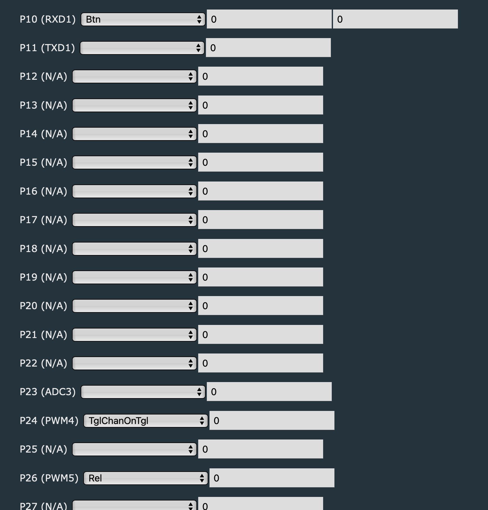
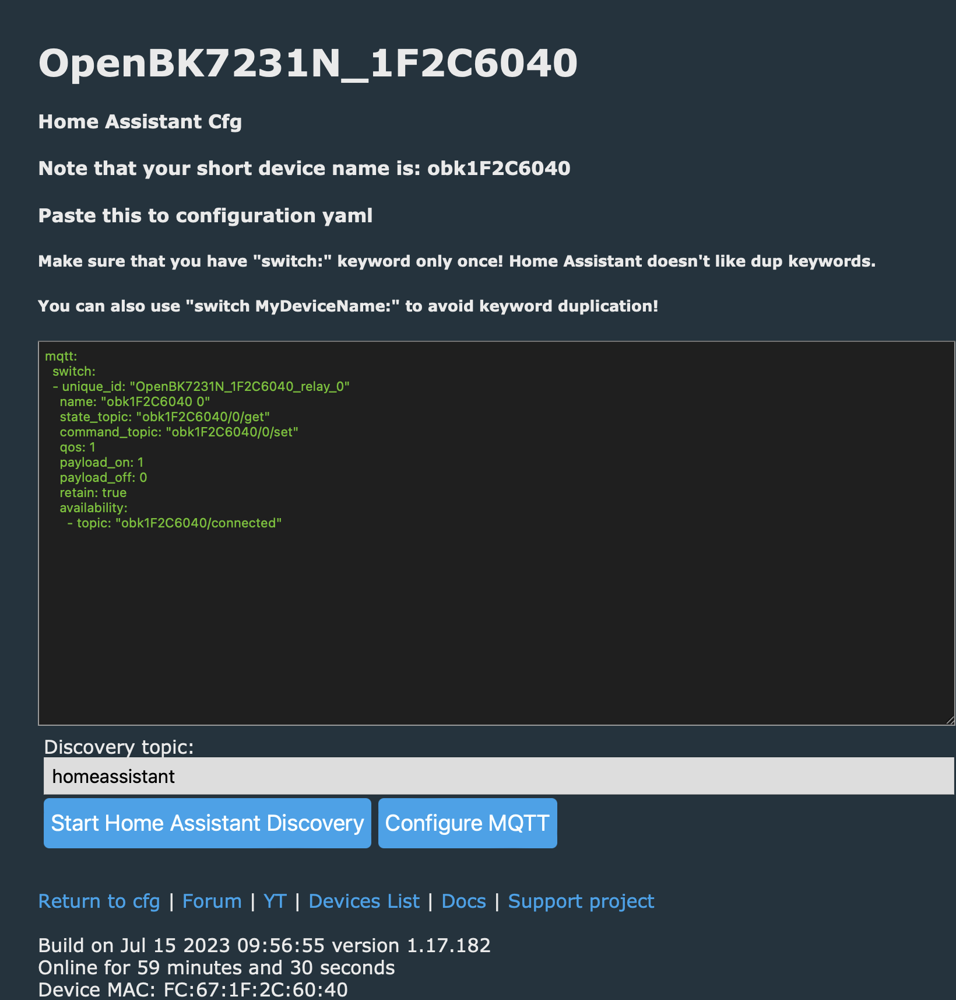
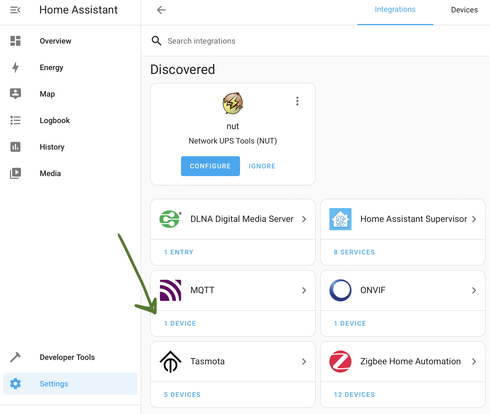
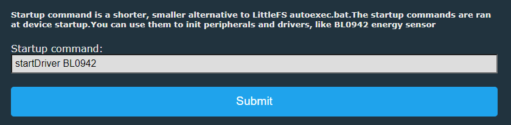

## Добавление и настройка реле aubess mini smart switch с чипом BK7231N (уже прошит на [openBeken](https://github.com/openshwprojects/OpenBK7231T_App))

- [Ветка на форуме](https://www.elektroda.com/rtvforum/topic3912748.html)
- [Рускоязычная документация](https://www.v-elite.ru/t34)

1. Подключаем датчик к wifi
2. Настраиваем пины (Configure Module)

! Примечание:

- P10 (RXD1) Btn и P26 (PWM5) Rel - позволили включать/выключать свет через панель настроек (192.168.4.1 - при подключении к сети которую раздает сам чим или 192.168.1.x если уже подключен к WiFi)
- P24 (PWM4) ToggleChannelOnToggle - переключение состояния через физический выключатель (аналоговый switch)

3. Вбиваем настройки MQTT сервера (Configure MQTT)
4. Переходим в Home Assistant Configuration (192.168.4.1 или 192.168.1.x). Там должна появиться конфигурация как на рисунке ниже (появляется только после настройки пинов).

5. Нажимаем "Start Home Assistan Discovery"
6. Переходим в сам Home Assistant -> Settings -> Devices&Integrations -> В MQTT модуле должен появиться датчик

7. Всё. Готово. Проверяйте, меняйте название. Выводите на главный экран и т.д.

## Вывод потребляемой энергии [Откуда взял инфу](https://www.elektroda.com/rtvforum/viewtopic.php?p=20266899#20266899)

1. Переходим в настройки датчика
2. Config -> Change Startup Command Text
3. Вводим вот такую команду:
   
4. Рестартим датчик
