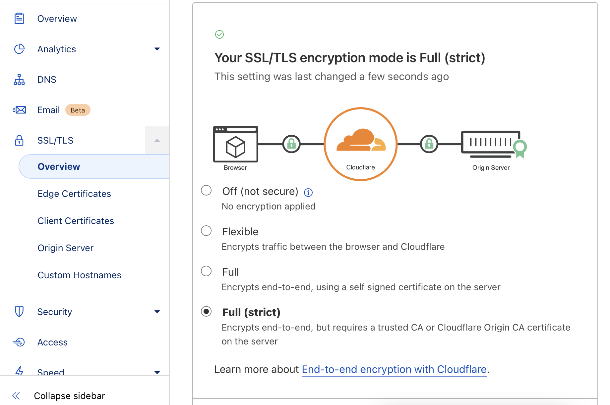
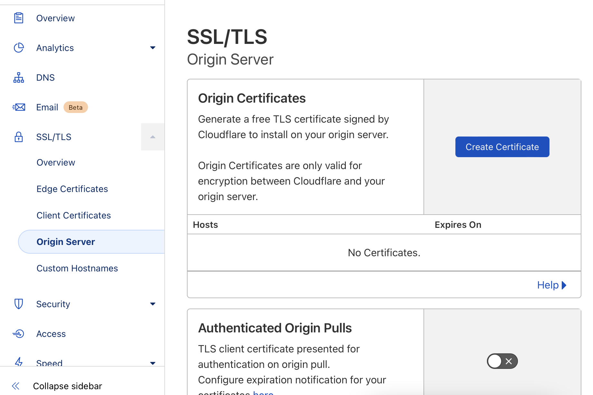
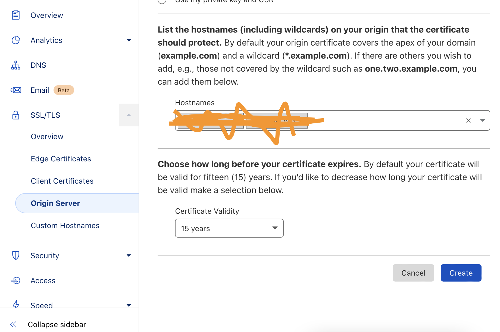
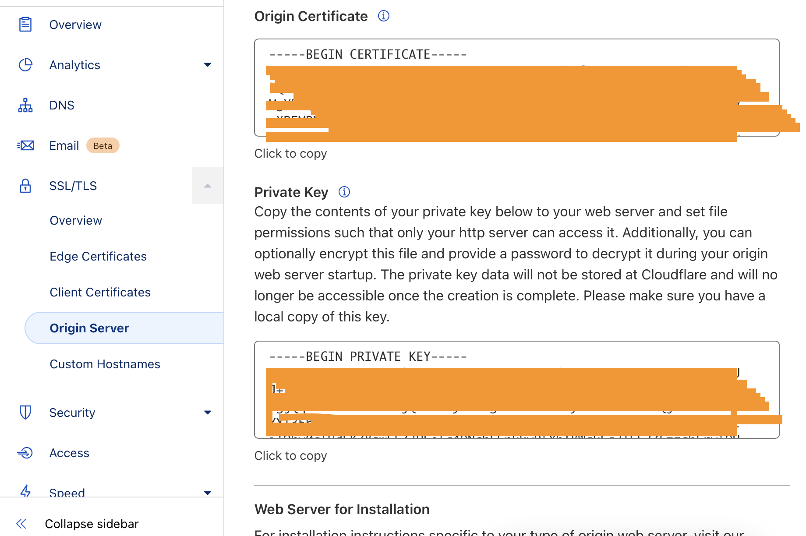
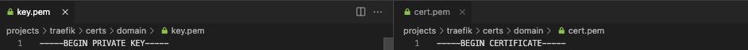
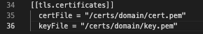
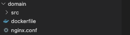
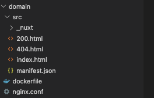
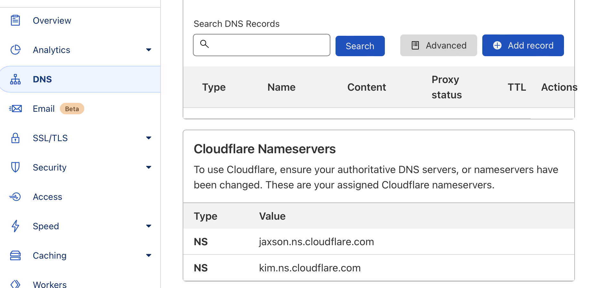
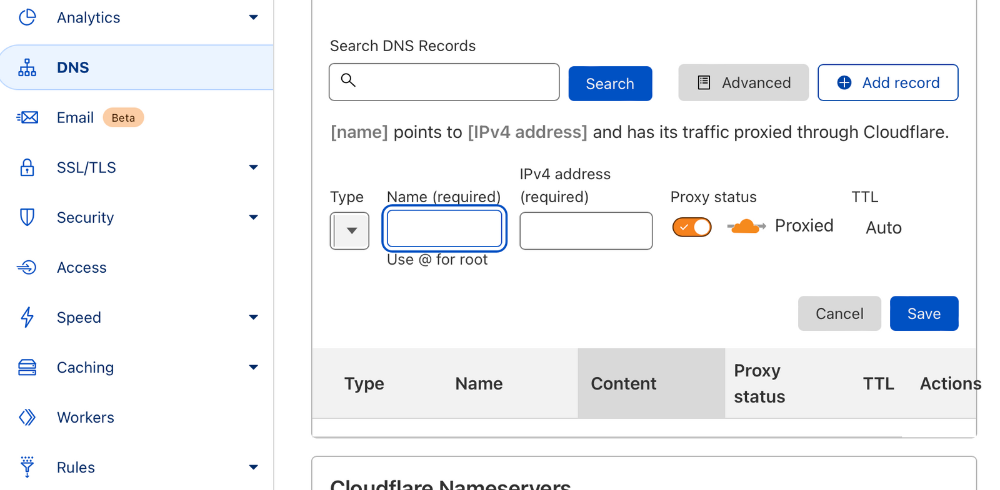

[На главную](README.md)

## Запуск сайта Docker\Cloudflare\nginx\remoteServer\Vue\Nuxt

### Глава 1. Настриваем cloudflare tls сертифика в docker\docker-compose, с traefik

1. Первый шаг и без объяснений - это добавление вашего доменна на cloudflare. Чтобы вы могли им управлять, менять DNS и т.д.

2. Настраиваем Full (strict) SSL/TLS



3. Получаем ssl сертификаты для домена



4. Кликаем на "Create Certificate"



5. Создаем сертификаты. Кликаем на "Create"



6. Данные нам ключи закидываем на сервер



7. Не забываем добавить сертификаты в конфигурацию traefik. В моем случае это файл dyn.toml. Там просто перечисление сертификатов под разные домены. Ничего больше



---

### Глава 2. Подготавливаем докер контейнер перед запуском

Нужно подчеркнуть, что я использую docker-compose. Поехали:

1. Создаем папку со следующим содержимым



2. Содержимое dockerfile ниже. Можно загружать последнюю сервию nginx. Я это делаю по причина минимизации занимаемого пространства. Просто на сервере более 7 сайтов, которые крутятся на nginx контейнере. А указывая одну и ту же версию во всех контейнерах, используется только один подгруженный файл, вместо разных

При запуске проекта, первым в ход пойдет dockerfile и дальше по инструкции:

- Подгружаем нужный нам nginx образ в контейнер
- Подхватываем все файлы из папки src и закидываем их в контейнер по пути, откуда по дефолту будет брать файлы nginx
- (Необязательно) На всякий случай, для удобства настройки сайта, заменяем дефолтный nginx.conf на собственно писанный
- Запускаем на 80

```dockerfile
FROM nginx:1.15.2-alpine
COPY ./src /var/www
COPY nginx.conf /etc/nginx/nginx.conf
EXPOSE 80
ENTRYPOINT ["nginx","-g","daemon off;"]
```

<p style="text-align: center;">dockerfile</p>

3. Содержимое nginx.conf ниже. Это просто конфигурация, которая работает. Можно её модифицировать как вам угодно

```nginx.conf
worker_processes auto;

events {
    worker_connections 8000;
    multi_accept on;
}

http {
    include       /etc/nginx/mime.types;
    default_type  application/octet-stream;

    server {
        listen 80;
        root /var/www;
        index index.html index.htm;

        location / {
            try_files $uri $uri/ /index.html;
        }

        location ~ ^.+\..+$ {
            try_files $uri =404;
        }
    }
}
```

<p style="text-align: center;">nginx.conf</p>

---

### Глава 3. Билдим vue\nuxt проект, дабы получить необходимую нам статику

1. Открываем папку проекта в VSCode

```
npm run generate
```

3. Сгенерируется папка dist. Всё ей содержимое нам нужно перекинуть на сервер в папку src описанная выше

4. После переноса, содержимое на сервере вот такое:



---

### Глава 4. Настраиваем и запускаем docker-compose.yml под наш сайт с сертификатом от cloudflare

1. Общая конфигурация docker-compose.yml файла с уже описанным нашим контейнером

```yml
version: "3.7"
services:
  traefik:
    image: traefik:v2.4
    container_name: traefik
    restart: always
    ports:
      - 443:443
    networks:
      - proxy
    volumes:
      - /var/run/docker.sock:/var/run/docker.sock:ro
      - ./traefik/traefik.toml:/etc/traefik/traefik.toml:ro
      - ./traefik/dyn.toml:/etc/traefik/dyn.toml:ro
      - ./traefik/certs:/certs

  # Наш проект
  projectname:
    build: ./domain
    container_name: domain
    restart: always
    networks:
      - proxy
    volumes:
      - ./domain/src/:/var/www
    labels:
      - traefik.enable=true
      - traefik.http.routers.domain.rule=Host(`domain.ru`)
      - traefik.http.routers.domain.entrypoints=https
      - traefik.http.routers.domain.tls=true
      - traefik.http.services.domain.loadbalancer.server.port=80

networks:
  proxy:
    name: proxy
    driver: bridge
```

<p style="text-align: center;">docker-compose.yml</p>

2. Осталось только запустить и проверить.

```
sudo docker-compose up --build projectname
```

### Глава 5. Настраиваем проксирование с домена на ваш сервер

1. Опять заходим на cloudflare в настройки я DNS вашего домена и кликаем на "Add record"




2. Впервую очередь добавляем в поле "name" имя вашего домена

3. В поле IPv4 вписываем ip адрес вашего сервера

4. По желанию можете добавить запись на www.

5. !!! Важное дополнение. Траефие компосирует мозги. Его нужно полностью остановить и пересобрать...

```
sudo docker-compose stop traefik
sudo docker-compose up --build traefik
```

6. Ну и собственно говоря done. Все должно работать
