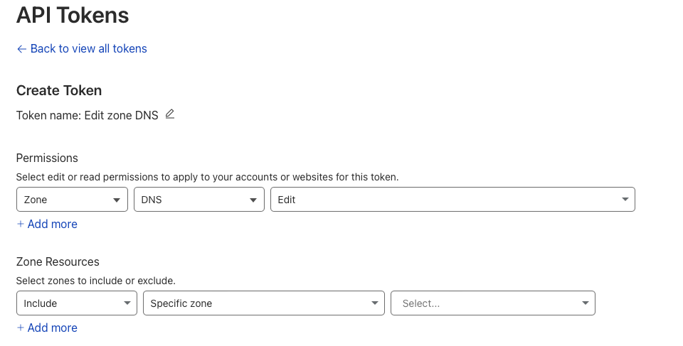

[Назад](./index.md) - [На главную](../README.md) - [Следующий шаг](./run_docker_mailserver.md)

## Получение ssl сертификатов, для шифрования трафика между клиентскими приложениями и вашим mail сервером в связке с cloudflare

Введение: 
Реализация шифрования (или настройка ssl/tls соедиения) супер важная часть. Без неё не будет работать.
Для дальнейшей работы вам необходим аккаунт cloudflare и домен, на котором будет крутиться mail сервер.

__При настройке docker-mailserver у нас есть два варианта:__
1. Если docker-mailserver запускается под proxy (например traefik), то 
вот [документация](https://docker-mailserver.github.io/docker-mailserver/edge/examples/tutorials/mailserver-behind-proxy/) 
как это дело нужно обруливать  
2. Если докер контейнер запускается на хосте (cap_add: - NET_ADMIN). В таком случае нам 
необходимо создать собственные сертификаты. 

### Далее мы будем рассматривать второй вариант :)

---

Идем в cloudflare и получаем API Token:
- My Profile > API Tokens > Create Token
- Edit zone DNS - Use template
- В Permission должны быть права Edit
- В Zone Resource, в поле Select выбираем нужный нам домен
- Далее нажимаем "Continue to summary"
- Копируем токен который нам покажут



---

Переходим на сервер и создаем файл /root/docker/mail/acme.sh/account.conf
```
export CF_Token="apiToken"
export CF_Account_ID="accountId"
```
И запускаем контейнер генерации сертификатов
```
docker run --rm -it -v /root/docker/mail/acme.sh/:/acme.sh --net=host neilpang/acme.sh --register-account -m your@email.com --issue --dns dns_cf -d domain.com
```
В папке по пути /root/docker/mail/acme.sh/domain.com_ecc будут находиться нужные нам файлы:
- fullchain.cer
- domain.com.key

--- 

[Следующий шаг](./run_docker_mailserver.md)