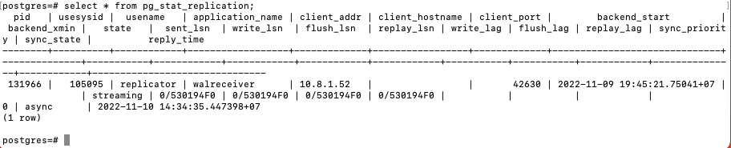
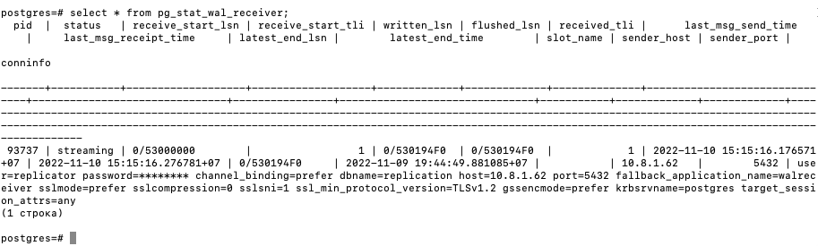

[На главную](./index.md) | [Предыдущий шаг](3-step.md) | [Следующий шаг](5-step.md)

# Тестирование и проверка нашей магии

_! При настройке Master - Slave у Slave присутствуют только права readonly. То есть мы можем подключаться к базе и читать любые данные (добавлять новые, изменять текущие или что-либо удалять нельзя)_

|

## Этап 1 - **pg_one_master** - **a_server**

Подключаемся к psql:

```
su postgres -c "psql -p 5432"
```

(psql) Проверяем работу мастера со слейвом:

```
select usename,application_name,client_addr,backend_start,state,sync_state from pg_stat_replication;
```

В моем случае результат команды выглядит следующим образом:


(psql) И для пущей уверенности, создадим базу данных:

```
create database testdb;
```

---

## Этап 2 - **pg_one_slave** - **b_server**

Подключаемся к psql:

```
su postgres -c "psql -p 5433"
```

(psql) Проверяем создание базы данных:

```
\l
```

_**Если в результате выполнения команды мы видим строку testdb, то репликация работает**_

(psql) Дополнительная проверка:

```
select pid, status, sender_host, sender_port from pg_stat_wal_receiver; --select * from pg_stat_wal_receiver;
```

В моем случае результат команды выглядит следующим образом:


---

[На главную](./index.md) | [Предыдущий шаг](3-step.md) | [Следующий шаг](5-step.md)
