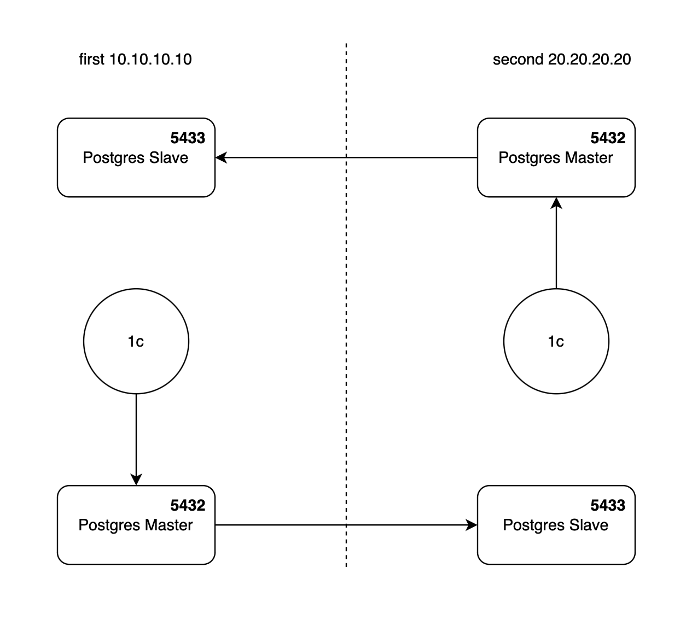

# PostgreSQL-1c и сервер взаимодействия 1с. Настройка отказоустойчивости и балансировки нагрузки

## Описание структуры:

Что мы имеем:

1. **a_server**. Первый сервер. ip = 10.10.10.10
2. **b_server**. Второй сервер. ip = 20.20.20.20
3. **pg_one_master**. Postgres Master на **a_server** на порту 5432
4. **pg_one_slave**. Postgres Slave на **b_server** на порту 5433
5. **pg_two_master**. Postgres Master на **b_server** на порту 5432
6. **pg_two_slave**. Postgres Slave на **a_server** на порту 5433
7. **1c_first**. Сервер взаимодействия 1с на **a_server**
8. **1c_second**. Сервер взаимодействия 1с на **b_server**

На первом сервере (**a_server** 10.10.10.10) имеется:

1. **pg_one_master**
2. **1c_first**
3. **pg_two_slave**

На втором сервере (**b_server** 20.20.20.20) имеется:

1. **pg_two_master**
2. **1c_second**
3. **pg_one_slave**

---

Этапы:

1. [Установка постгрес от 1с](1-step.md)
2. [Создание мастер базы PostgreSQL **pg_one_master** на сервер **a_server**](2-step.md)
3. [Настройка репликации **pg_one_master** в базу **pg_one_slave** на **b-server**](3-step.md)
4. [Тестирование и проверка нашей магии](4-step.md)
5. [Slave -> Master. Отработка ситуации, когда сдох **a_server** и база **pg_one_master** больше недоступна](5-step.md)
6. [Slave -> Master -> Slave. Отработка ситуации, когда чудесным образом удалось восстановить **a_server** и необходимо всё вернуть на круги своя](6-step.md)

---

Итоги и примечания:

- Важно понимать, что репликация и бэкапы базы данных это две независимые и обязательные вещи. Репликация может произойти с ошибками и эти ошибки продублируются на slave-е. Поэтому рекомендую хотя бы раз в день, желательно ночью, делать бэкап командой pg_dump. И лучше всего на третий независимый сервер, чтобы в случае потери обоих серверов не потерять критически важные данные

- [Пример postgresql.conf](./notes.md)
---

Список литературы:

- [09.11.2022] https://it-lux.ru/streaming-replication-master-slave-posgtresql-12/
- https://github.com/justficks/server-1c-on-linux-with-postgres
