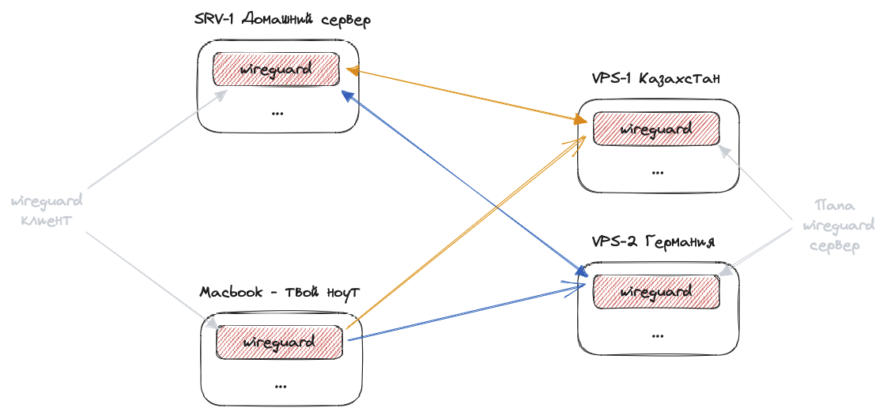

## Настройка wireguard на машине, для доступа к ней через VPN откуда угодно

### Задача: иметь доступ к своему локальному серверу откуда угодно и безопасно

Предисловие:



Имеем несколько машин машины:

- vps-1 и vps-2 - это VPS сервера за рубежом, которые являются папой wireguard. Через них идет трафик и подключения
- srv1 - это личный сервер\компьютер стоящий у тебя дома и не имеющий статического ip адреса. Находиться за NAT твоего роутера
- macbook - это твой компьютер, с которого ты будешь подключаться к своему серверу откуда угодно, где есть интернет

Список действий:

1. Установка папа wg на vps-1 & vps-2
2. Подключение wg соединений с германией и казахстаном

---

### Установка папа wg на vps-1 & vps-2

- **(vps-1 & vps-2)** Устанавливаем wg и генерим ключи

```bash
apt install wireguard
cd /etc/wireguard
umask 077
wg genkey > vps(1/2)-private.key
wg pubkey < vps(1/2)-private.key > vps(1/2)-public.key
```

- **(vps-1 & vps-2)** Создаем конфиг wg0.conf

```bash
sudo nano /etc/wireguard/wg0.conf
```

С содержимым для vps-1:

```
[Interface]
Address = 10.13.13.1
ListenPort = 51820
PrivateKey = % vps1-private.key content %
PostUp = iptables -A FORWARD -i %i -j ACCEPT; iptables -A FORWARD -o %i -j ACCEPT; iptables -t nat -A POSTROUTING -o eth+ -j MASQUERADE
PostDown = iptables -D FORWARD -i %i -j ACCEPT; iptables -D FORWARD -o %i -j ACCEPT; iptables -t nat -D POSTROUTING -o eth+ -j MASQUERADE
```

С содержимым для vps-2:

```
[Interface]
Address = 10.8.1.1
ListenPort = 51820
PrivateKey = % vps1-private.key content %
PostUp = iptables -A FORWARD -i %i -j ACCEPT; iptables -A FORWARD -o %i -j ACCEPT; iptables -t nat -A POSTROUTING -o eth+ -j MASQUERADE
PostDown = iptables -D FORWARD -i %i -j ACCEPT; iptables -D FORWARD -o %i -j ACCEPT; iptables -t nat -D POSTROUTING -o eth+ -j MASQUERADE
```

- **(vps-1 & vps-2)** Запускаем

```bash
sudo systemctl start wg-quick@wg0.service
```

- **(vps-1 & vps-2)** Включаем автозапуск при старте системы

```bash
sudo systemctl enable wg-quick@wg0.service
```

- **(vps-1 & vps-2)** Проверяем #1

```
sudo wg
|
interface: wg0
public key: % vps1-public.key %
private key: (hidden)
listening port: 51820
```

- **(vps-1 & vps-2)** Проверяем #2

```
ip a
|
3: wg0 ...
```

---

### Подключение wg соединений с германией и казахстаном

- Устанавливаем wg и генерим ключи

```bash
apt install wireguard
cd /etc/wireguard
umask 077
wg genkey > srv1-private.key
wg pubkey < srv1-private.key > srv1-public.key
```

- Создаем конфиг wg0.conf **(казахстан)**

```bash
sudo nano /etc/wireguard/wg0.conf
```

С содержимым:

```conf
[Interface]
Address = 10.13.13.12
PrivateKey = % srv1-private.key %
DNS = 1.1.1.1

[Peer]
PublicKey = % vps-1-public.key % # Публичный ключ vps-1
Endpoint = ip_vps1:51820 # IP адрес vps-1 в сети интернет
AllowedIPs = 10.13.13.0/24 # Доступ к этой машине с любых vpn подключений от 10.13.13.1 - 10.13.13.255. Если указать 0.0.0.0/24 - то будут конфликты двух wg соединений и интернет вовсе пропадет, так как весь трафик будет идти через наш vps-1
PersistentKeepalive = 25# Обязательный параметр, иначе будет пропадать соединение из-за бездействия и доступ будет потерян
```

- Создаем конфиг wg1.conf **(германия)**

```bash
sudo nano /etc/wireguard/wg1.conf
```

С содержимым:

```conf
[Interface]
Address = 10.8.1.112
PrivateKey = % srv1-private.key %
DNS = 1.1.1.1

[Peer]
PublicKey = % vps-2-public.key % # Публичный ключ vps-2
Endpoint = ip_vps2:51820 # IP адрес vps-2 в сети интернет
AllowedIPs = 10.8.1.0/24 # Доступ к этой машине с любых vpn подключений от 10.8.1.1 - 10.8.1.255. Если указать 0.0.0.0/24 - то будут конфликты двух wg соединений и интернет вовсе пропадет, так как весь трафик будет идти через наш vps-2
PersistentKeepalive = 25 # Обязательный параметр, иначе будет пропадать соединение из-за бездействия и доступ будет потерян
```

- Запускаем

```bash
sudo systemctl start wg-quick@wg0.service
sudo systemctl start wg-quick@wg1.service
```

- Включаем автозапуск

```bash
sudo systemctl enable wg-quick@wg0.service
sudo systemctl enable wg-quick@wg1.service
```

- Проверяем соединени с интернетом (или ping 1.1.1.1):

```bash
ping google.com
```

- Проверяем ip адрес. Он должен быть таким же, как если дома на macbook зайти на сайт 2ip.ru:

```bash
curl ipinfo.io/ip
```

---

[Ссылка на полезный видеоматериал](https://www.youtube.com/watch?v=bVKNSf1p1d0)
